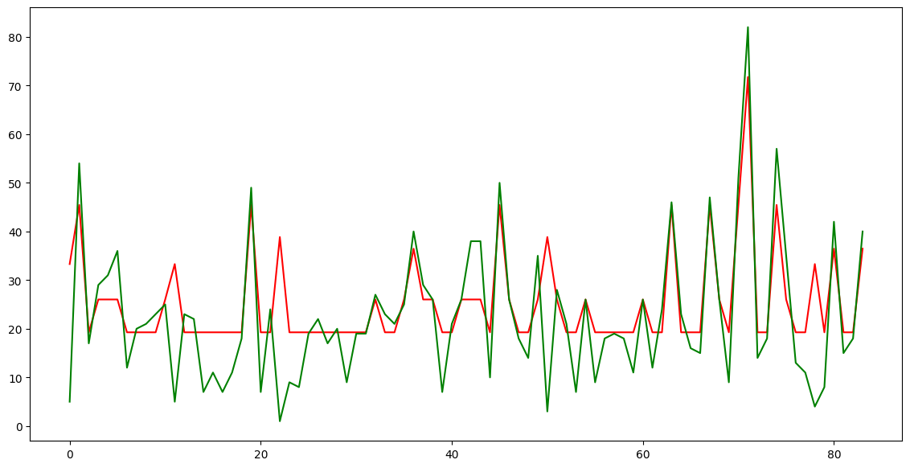
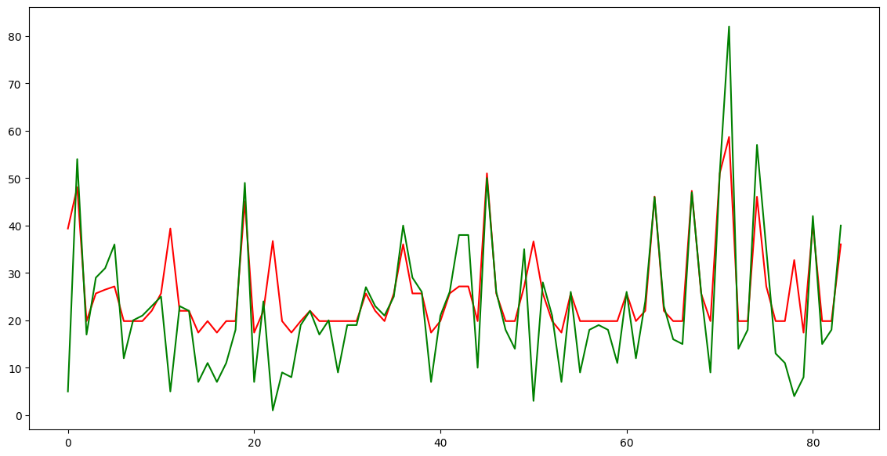
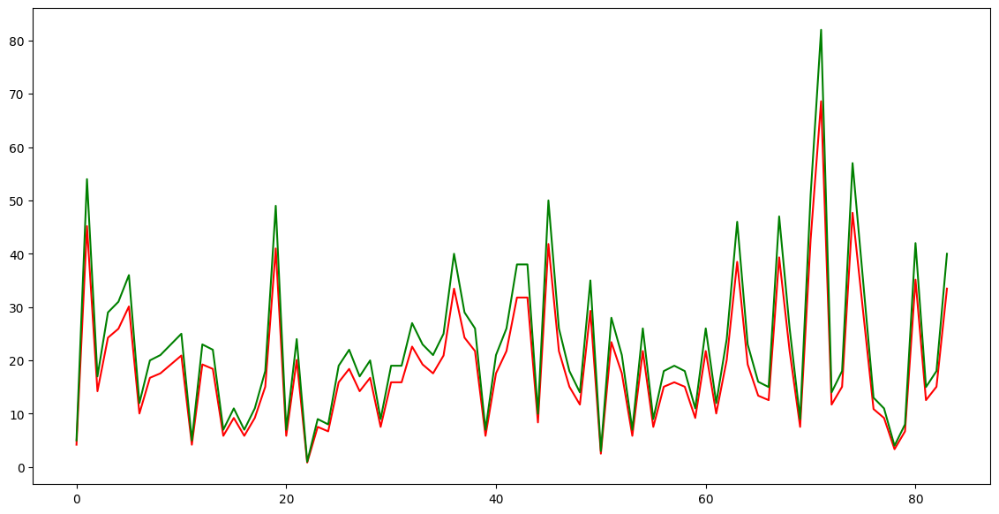

# Задача на прогнозирование временных рядов с размером окна 1 & шагом 1

**Исходные данные:**
- Выборка (321, 49) массив данных, файл в формате Excel прилагается.

**Задача:**
- Разработать модель для прогнозирования одномерного временного ряда (Размер окна 1, шаг1)
- Разработать общий код на языке Python. (Столбцы Value в исходной выборке можно суммировать по строкам)
- Добиться точности прогноза не ниже 75%.
- Построить графики. 

## Решение
Первм этапом выполнялась нормализация и преобразование данных. Как и было сказано в задании многомерный временной ряд был приведен к одномерному посредством суммирования по строкам.
Так же было выявлено, что некоторые даты в таблице пропущены, а так же некоторые строки имеют нулевое значение.
В данном случае было принято решение принять все пропущенные даты, как нулевое значение, и исходя из этого исключить из набора данных все строки, значения которых равны нулю. (В некоторых последующих экспериментах нулевые строчки оставлялись)

 Для решения поставленной задачи было проведено несколько A/B тестов. Выполнялось тестирование таких моделей, как:
 - Модель нейронной сети
 - Алгоритм "Случайный лес"
 - Алгоритм "Дерево решений"
 - Алгоритм "Логистическая регрессия"

При решении поставленной задачи **с помощью модели нейронной сети** были использованы десятки различных гиперпараметров и комбинаций слоев. Однако данное решение не привело к искомому результату.
Наилучший показетль точность при таком подходе по метрике **R2 составил 0.4**. Результат прогнозирования представлен на рисунке:

При решении поставленной задачи **с помощью алгоритма дерево решений** для подбора гиперпараметров использовался метод GridSearch. Однако данное решение не привело к искомому результату.
Наилучший показетль точность при таком подходе по метрике **R2 составил 0.6**. Результат прогнозирования представлен на рисунке:

При решении поставленной задачи **с помощью алгоритма случайный** для подбора гиперпараметров использовался метод GridSearch. Однако данное решение не привело к искомому результату.
Наилучший показетль точность при таком подходе по метрике **R2 составил 0.66**. Результат прогнозирования представлен на рисунке:

При решении поставленной задачи **с помощью линейной регрессии** Наилучший показетль точность по метрике **R2 составил 0.9073**. Результат прогнозирования представлен на рисунке.
При этом в гиперпараметрах модели параметр fit_intercept был отключен (False). Основано это на следующих выводах:

fit_intercept - это параметр, который используется при обучении модели линейной регрессии. Если fit_intercept установлен в значение True, то в модель будет включён дополнительный коэффициент, называемый сдвигом (intercept).
Сдвиг позволяет модели учитывать смещение в данных, когда зависимая переменная не проходит через начало координат.Однако, когда речь идёт о предсказании одномерного временного ряда с размером окна 1 и шагом 1, то это будет состоять из простых временных шагов без рассмотрения дополнительного коэффициента смещения. 
Учитывая это, использование fit_intercept не требуется в данном случае. Предсказание для одномерного временного ряда с размером окна 1 и шагом 1 выполняется на основе только самого ряда данных и не требует включения смещения.

